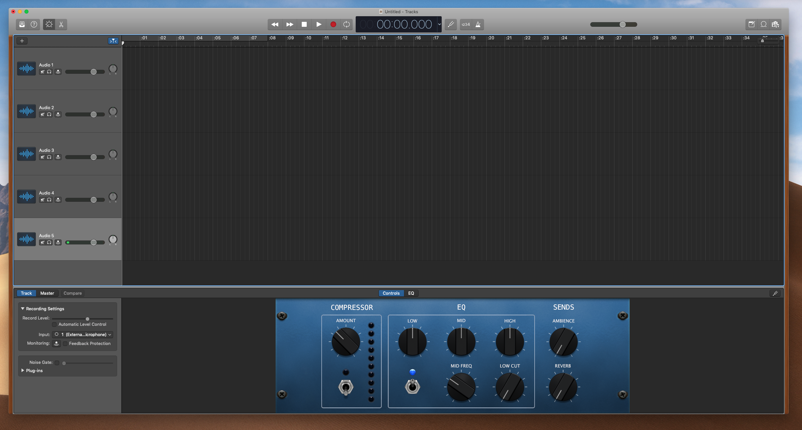

# Podcasting with GarageBand

Welcome to the *podcasting with GarageBand* workshop. Today we'll go through the basics of how to record and edit audio in GarageBand. We'll do this with a few sample audio files I've created, which you can download [here]([https://github.com/djstory/podcasting/blob/master/sample-audio/All%20files.zip](https://github.com/djstory/podcasting/blob/master/sample-audio/All files.zip)).

We'll start by talking briefly about recording setups for speech. Then I'll run through how I put together the sample podcast files in GarageBand. Then I'll invite you to do the same—and I'll be around to help and answer questions as you work.

So, here goes...

## Recording for Speech

### Recording Environment

- Find a quiet space—the smaller and more padded the better to minimize echo

- Some options:

  - [DSC podcasting room](https://guides.library.ucsc.edu/DSC/Podcasting)

  - Your dorm room or apartment

  - Inside a (non-moving!) car

    

### Microphone Options

* Yeti and other USB mics ([borrow in the DSC](https://guides.library.ucsc.edu/DSCEquipment/Home#s-lg-box-wrapper-22925798))
* Your phone

## Getting to Know GarageBand

Listen to the a complete sample project.

Grab the individuals (or record some or all of your own) and assemble a sample project.

Note the ? tool in the upper left

### 1) Start Your Project

- Open GarageBand and start a new project—don't select Voice, select Empty Project
- For Track Type, select Audio (the default)
- Do some simple setups to make GB friendly for podcasting (rather than recording music)
  - Turn off metronome and counter
  - Set to time (minutes and seconds) instead of bars
- Note the ? tool in the upper left—it can be useful figuring out what particular buttons do

- Duplicate your new track to create as many tracks as you'll need
- Save your project

### 2) Setup Your Tracks

- Start importing the audio files you have (dragging files in from Finder is the easiest way to do this)
  - If you haven't yet, download the audio files [here](https://support.apple.com/kb/PH24957?locale=en_US).
- Place tracks from top to bottom according to the order they will occur in your episode—it should look like stair steps going down from left to right
- TIP: You'll be much better off in GarageBand if you spend ample time storyboarding your podcast before you even start recording and editing.

### 3) Record and Edit Your Speaking Tracks

#### *Recording*

* Select the track you want to record in and select Record Enable (small red button on track)
  * If the Record Enable button is not visible, you can set it to appear by right clicking on the track head and selecting Configure Track Head
* Rename the track something descriptive
* Check that your mic input levels are good (loud enough but without getting into the red)
* Also be sure to mute any other tracks that you don't want to hear as you record
* Place the cursor at the start of the track and hit record

#### *Editing*

* When you have a take that you like, cut off the areas of the track you don't want
  * To select an area to remove, put the cursor on one side of it, right click, and select Split at Playhead
  * Select the region you don't want and hit delete
* Open the sound library and select the patch you want for the track (Narration Vocal is ideal)
* In Smart Controls (at bottom of screen), us the track's Noise Gate to reduce any white noise

### 4) Import Your Additional Audio

* With a Finder window open nearby, drag in the additional audio files you want to use
  * Intro or outro tracks
  * Jingles
  * Sound bites
  * Interview audio
* Arrange the tracks in order from top to bottom according to when you plan for them to appear

### 5) Edit and Arrange All Tracks

- Slide track regions left to right to where they should appear—go for a stairstep down formation
- After everything is in place, use the volume automation tool to set volumes for particular portions and create fade in and fade out
  - If Automation tools are not visible, you can show them from the Mix menu at the top
  - Make sure the blue automation button is turned on
  - Make sure that Volume is selected from the drop down menu below
  - Click the track audio to reveal the automation bar
  - Drag it up and down to change overall volume on the entire track
  - Click on the line in the specific places you want the volume to go up and down
  - Drag the nodes up or down until you have the right volume for the each section

### 6) Save and Export

- Save your project
- In the top menu, select Share > Save Song to Disk
- Save as an MP3

### If There's Time...

- Open a new empty project
- Throw together your own jingle with GarageBand loops
- Export as MP3 and drag into your main project

## Additional Resources

* Sample audio files for this tutorial: https://support.apple.com/kb/PH24957?locale=en_US
* Some helpful keyboard shortcuts: https://support.apple.com/kb/PH24957?locale=en_US
* GarageBand for Podcasters tutorial: https://www.buzzsprout.com/blog/garageband-podcast-tutorial
* Eliminating background noise: https://www.youtube.com/watch?v=ZlX2AdC-4Xg
* More details about the automation tool: https://www.youtube.com/watch?v=ceQdiQJgfHk

## Contact

- Daniel Story, Digital Scholarship Librarian, University of California, Santa Cruz
- Website: [digitalscholarship.ucsc.edu](http://digitalscholarship.ucsc.edu)
- Email: [dstory@ucsc.edu](mailto:dstory@ucsc.edu) 
- Twitter: @danieljstory