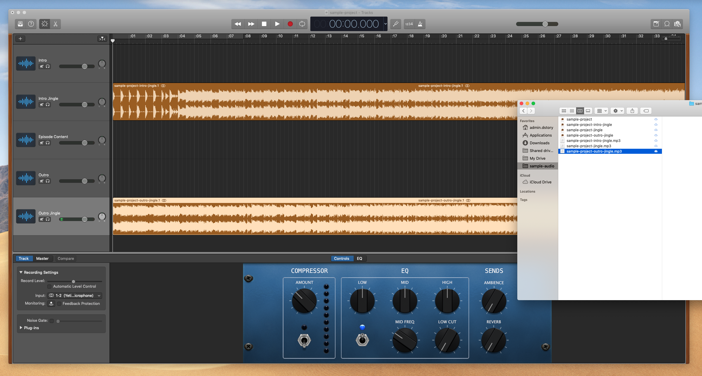

# Podcasting with GarageBand

##Recording for Speech

###Microphone Options

* Yeti and other USB mics ([borrow in the DSC](https://guides.library.ucsc.edu/DSCEquipment/Home#s-lg-box-wrapper-22925798))
* Your phone

### Recording Environment

* Find a quiet space—the smaller and more padded the better to minimize echo
* Some options:
  * [DSC podcasting room](https://guides.library.ucsc.edu/DSC/Podcasting)
  * Your dorm room or apartment
  * Inside a car

## Getting to Know GarageBand

Listen to the a complete sample project.

Grab the individuals (or record some or all of your own) and assemble a sample project.

### Start Your Project

- Open GarageBand and start a new project
  - Don't select "Voice," select empty project and check detail tab
- Select an audio project and check your input setting
- Setup GB for podcasting (rather than recording music)
  - Turn off metronome and counter, set to time (minutes and seconds)
  - Turn off master effects
  - Save your project
- Note the explore tool

###Setup Your Tracks

- Create a new track, then duplicate for a total of 5 tracks, then label them
- Import music
- Record intro and outro
  - Find a good level and distance—make sure you're not distorting
- Import main podcast audio

### Edit

- Remove unwanted portions of a tracks
- Move track regions to where you want them—go for a stairstep down formation
- AFTER everything is in place, create the fade-in and fade-out for music tracks
- Checkout the master track—it is applying compression and setting your overall volume

### Save and Export

- In the top menu, select Share > Save to Disc
- Export as MP3

### If There's Time...

- Open a new empty project
- Throw together your own jingle with GB loops
- Export as MP3 and drag into your main project

## Additional Resources

https://resonaterecordings.com/2018/07/garageband-tutorial-for-podcasting/

## Contact

- Daniel Story, Digital Scholarship Librarian, University of California, Santa Cruz
- Website: [digitalscholarship.ucsc.edu](http://digitalscholarship.ucsc.edu)
- Email: [dstory@ucsc.edu](mailto:dstory@ucsc.edu) 
- Twitter: @danieljstory